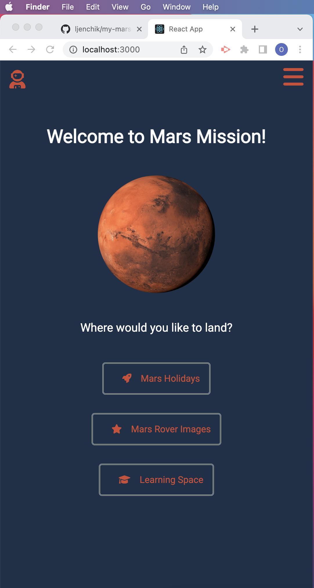
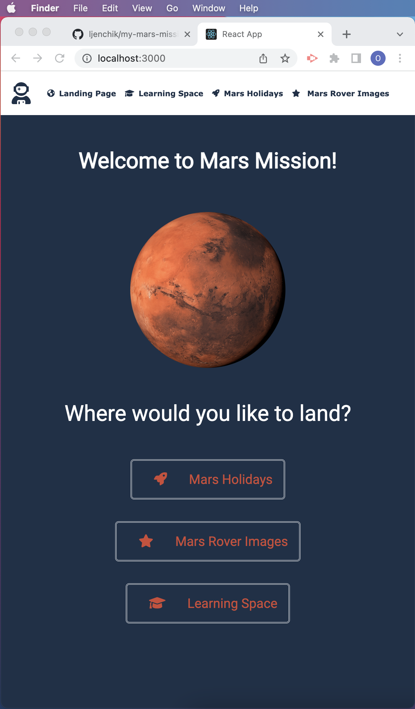
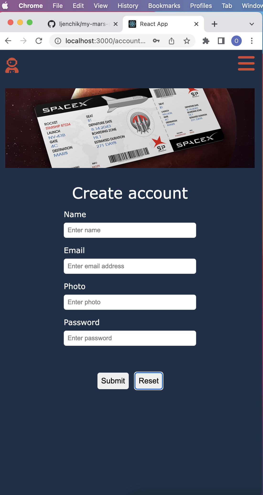
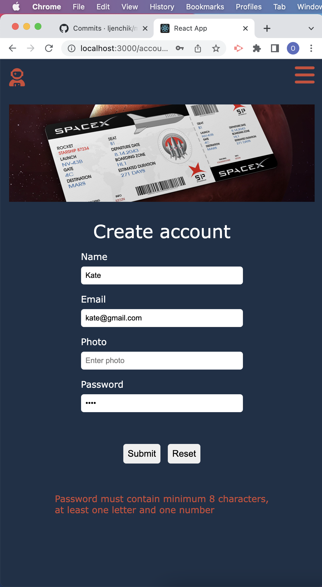
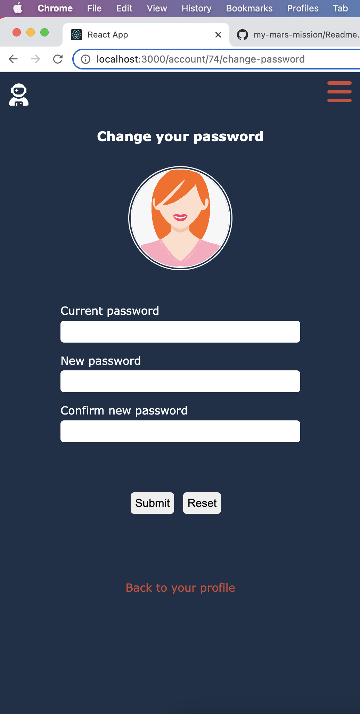

# My Mars Mission

## My Mars Mission is a website for teenagers about Mars. 

I wanted to create not only engaging website but also apply my new skills (TypeScript, React and Node.js) to a real project.

In TechSwitch coding bootcamp my favourite exercise was Mars Mission. As a team of seven we had to create an educational website about Mars for teenagers. The task was exciting and provided a great opportunity to apply everything we had learnt before. We created a project from scratch: planned, designed and presented it in front of other software developers. We built a React frontend application and learnt how to implement components. I was impressed with the development process, team work and the results we achieved. 

After completing the course I decide to work on My Mars Mission project on my own to practice and add new features and functionality. In the frontend, I added media queries, styling, new pages such as login, create account, tickets to Mars and so on. I used Postgres for the backend to store users' and Mars tickets' details. I learnt how to store and safely change passwords using bcrypt technology. Also, I improved my CSS skills. 

## To build aproject you need to install VS Code, Docker and PgAdmin4. Then run the following commands:

### 1. Create and open a folder in VS Code where you want to clone my-mars-mission project.

### 2. Clone my-mars-mission repository from https://github.com/ljenchik/my-mars-mission into your folder by running the following command in VS Code terminal
 
```
 git clone git@github.com:ljenchik/my-mars-mission.git
 ```

### 3. Navigate to a backend folder and start running docker container

```
docker-compose up -d 
```

### 4. In a backend folder run

```
npm install
```

### 5. To start backend run:

```
npm start
```

### 6. In PgAdmin4 create database. Let's name it Mars (or any other name you want)

### 7. Before running migrations, check if knexfile.ts looks like this:

    ```
    const config:{[name: string]: any} = {
        development: {
            client: "pg",
            connection: {
            database: "Mars",
            user:     "Olena",
            password: "1234"
            }
        }
    }
    export default config;
    ```

Note: name of your database in knexfile.ts should be the same as the name of your database in PgAdmin4.

### 8. In backend folder 4 times run: 

```
knex migrate:up
```

You will see 2 tables created in your database: account and ticket.

### 9. Open a terminal for the frontend. Navigate to a frontend folder.

### 10. Run: 

```npm install
```

and 

```
npm start
```

## Usage

### Landing Page

Home page of My Mars Mission website is called a Landing Page. It contains Mars image, three buttons-links: Mars Holidays, Mars Rover Images, Learning Space, a burger menu for smaller screens and a navbar for bigger screens as well as a link in a form of astronaut icon. When a user hovers over the links the cursor changes to the pointer and the colour of the text and the icons changes to white.

<p float="center">

</p>

At the top left corner there is an astronaut icon which links to create account and login page. To browse the website a user doesn't need to login but in order to book a ticket to Mars or see all booked tickets a user has to create account and login.

At the top right corner there is a hamburger menu. When clicked, it displays a list of links to a Landing Page, a Learning Space, Mars Holidays and Mars Rover Images. Next to the links there are small icons which symbolise each page. The links and the icons change the colour to white when the cursor hovers over. The cross icon at the top left corner of the opened hamburger menu is used to close the menu. Alternatively, the user can click on a black background and close the menu.

<p float="center">

</p>

For bigger screens, instead of the hamburger menu, a user will see a navbar. The navbar displays the same links and the corresponding icons as the hamburger menu. The cursor changes to the pointer and an orange line appears underneath to make the link more visible while hovering over.

<p float="center">

</p>

### Learning Space

Learning Space page exhibits a multiple choice quiz about Mars. The page consists of five sections: a question title and a corresponding image, an information about Mars, a quiz question, based on the provided information, three answers, one of which is correct, and previous/next buttons with a text between them to display a question number.

When user clicks on a correct answer, the border of the answer turns green, and if the answer is wrong the border changes to red. A user can navigate from a question to question without choosing the answer.

<p float="center">


</p>

At the moment there are only 3 questions in the quiz. I hope to add more questions later. Also, I want to display the number of user's correct answers. And add another page with a prompt such as "Do you want to learn something new about Mars? Start a quiz" as well as add Finish quiz button (when clicked the score would be displayed).

### Mars Rover Images

Mars Rover Images page displays the photographs taken by Perseverance Rover on Mars. The first available image was dated of 18 February 2021. That's why this date is shown at the date-picker field. To get the images I used the NASA Open Api. 

<p float="left">

</p>

When this page is open, a user sees a carousel of the twenty images with the first hero image at the center. The images are not the same every time. I shuffle all the images taken at the specific date and display the first twenty.

A user can select any date from a date-picker box starting from 18/02/2021. If there are no images taken on the chosen date, a message "There were no photographs taken on this date. Please choose another date" will be displayed along with a Mars image from a Landing Page.

<p float="left">


</p>

For smaller screens a list of thumb images is located under the hero image, in contrast to bigger screens, where thumb images are located at the bottom of the hero image.

### Mars Holidays

In order to explore a Mars Holidays page a user has to create an account: to provide name, email, photo (optional) and password. I validate all input data. If there is no name, "Enter name" message will be displayed as well as the corresponding label Name and input box will be highlighted in orange. Password must contain at least 8 characters with one number and one letter. If password is not in a correct format, a user will see a message with an error.
After a successful account data validation, a user will land in a login page.

<p float="left">





</p>

After login, a user will be shown a page where he/she is able to: 1) book a ticket to Mars, 2) view all booked tickets if there are any, and 3) by clicking on profile image or a photo (in case it was provided) to see and update account details, add photo and change password.

Let's explore a book ticket option first. Once again, I validate all information provided by a user, and in case of any issue, an error message will be displayed.

<p float="left">


</p>

After pressing a submit button, a user will be shown his/her ticket.

<p float="left">


</p>

The second option is to press My tickets button. In this case a user will see all booked tickets or a message "There are no tickets on your account".

<p float="left">


</p>

The third option is to click on a Profile image or photo (if provided). User's information page will be shown: photo, name, a date when profile was created and a date when profile was updated (if it was updated).

There are four buttons to explore: 1) Update details, 2) Change Password, 3) Book Ticket and 4) My Tickets. The last two are already explained in the previous paragraphs. 

<p float="left">

</p>

Let's have a look at Update details option first. 

<p float="left">


</p>

After successful filling in all the fields, a user will see a message "User's name, you successfully updated your details" and a link which navigates to user's profile.

In the Change Password page a user is able to type in a current password, a new password, confirm a new password and submit. If there is an issue, an error message will be displayed underneath.

<p float="left">


</p>